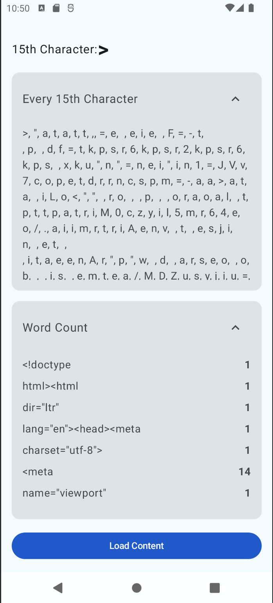
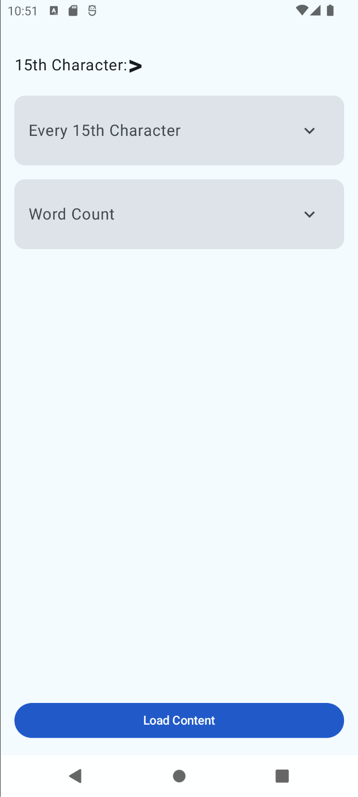
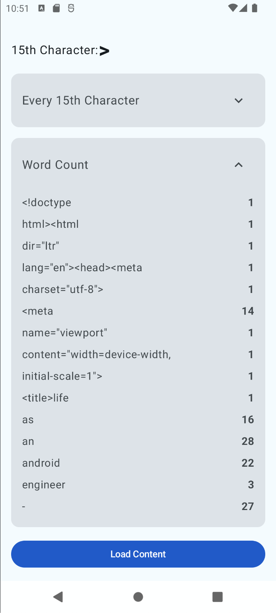
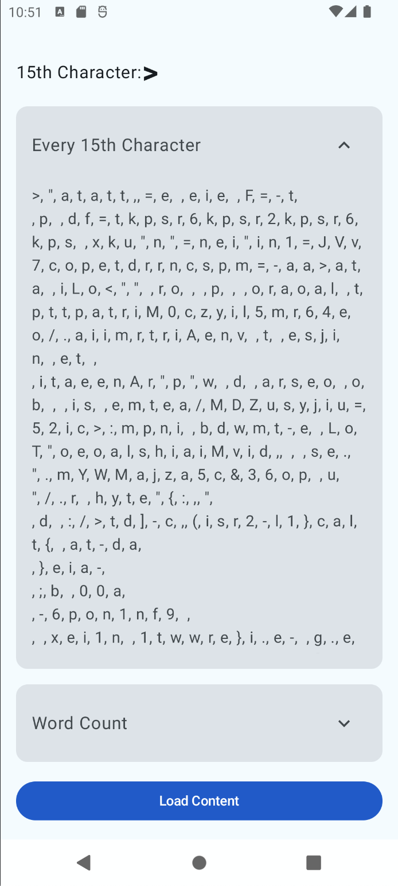
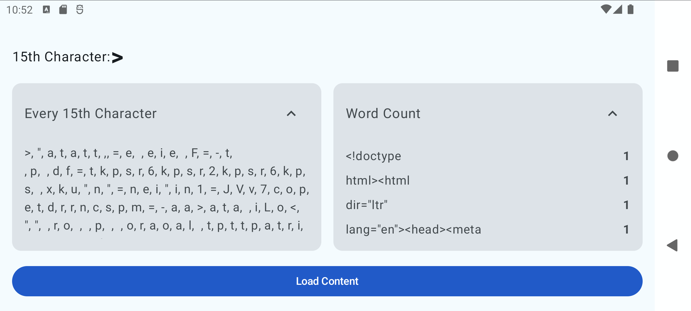
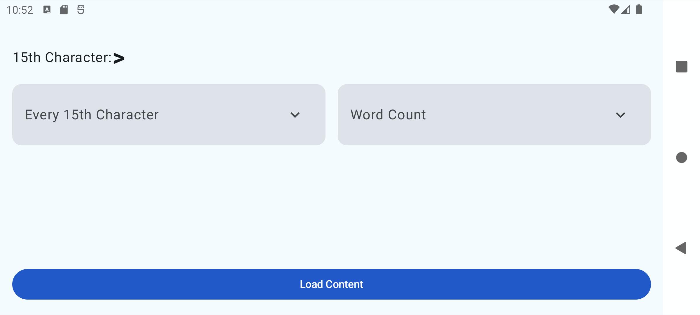
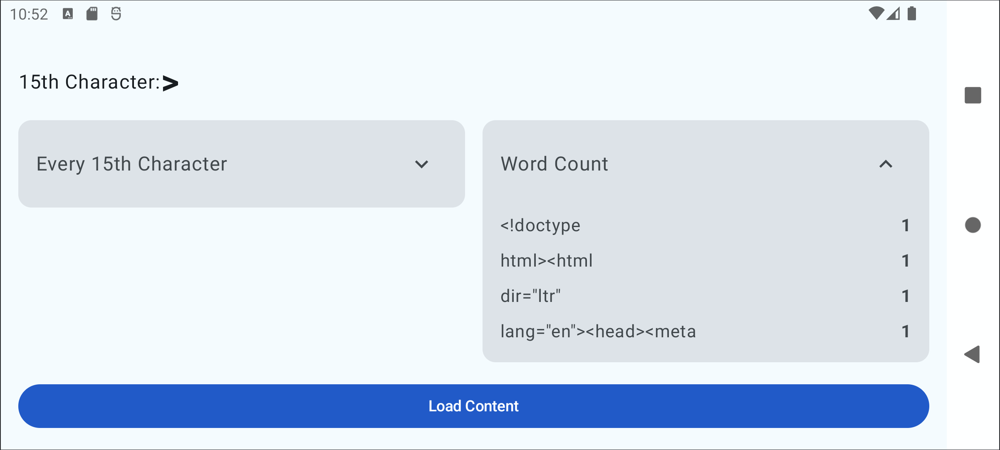

# Truecaller Assignment: Characters and Words Analyzer

This Android application fetches content from a specified URL and performs various text analyses, including finding the 15th character, every 15th character, and word count. The app is built using modern Android development practices and Jetpack Compose for the UI.

## Code Structure

The project follows a clean architecture pattern with the following main components:

### View
- All UI-related code is implemented using Jetpack Compose.
- The main UI components can be found in the `view` package.
- The app uses a responsive design to adapt to different screen orientations and sizes.

### ViewModel
- The `MainViewModel` class contains the business logic for the app.
- It handles data processing and serves as a bridge between the View and the Repository.
- Located in the `viewmodel` package.

### Repository
- The `TruecallerRepository` interface and its implementation handle backend API interactions.
- It's responsible for fetching the website content and performing text analysis operations.
- Located in the `repository` package.

## Features

1. Fetches content from a specified URL.
2. Displays the 15th character of the content.
3. Shows every 15th character of the content.
4. Provides a word count for the content.
5. Responsive design:
    - In portrait mode, 15th Character, Every 15th Character, and Word Count layouts are shown one below the other.
    - Every 15th Character and Word Count are displayed in accordion views.
    - In landscape mode, the accordions are placed in a Row for better space utilization.

## Things Not Included

1. Error view when the API request fails. Currently, if the request fails, the app will show the initial blank screen without any error message.
2. Internet connectivity check. The app assumes an active internet connection.
3. Explicit caching logic other than what is provided by Retrofit.

## Testing

The project includes unit tests for the ViewModel and Repository classes. These tests cover the core functionality of the app and ensure that data is processed correctly.

## Libraries Used

- Jetpack Compose: For building the UI
- Hilt: For dependency injection
- Retrofit: For network requests
- Coroutines: For asynchronous programming
- LiveData: For reactive data holding
- ViewModel: For managing UI-related data

## Getting Started

To run this project:

1. Unzip the file shared
2. Open the project in Android Studio
3. Build and run the app on an emulator or physical device

## Future Improvements

- Implement error handling and display error messages to the user
- Add internet connectivity checks
- Implement a more sophisticated caching mechanism
- Enhance the UI with animations and transitions

## Screenshots

The first 15th Character is shown as a Row with Label in small normal font and the result is shown with a bigger font size and font weight - bold.

### Portrait Mode

1. **Both Accordions Expanded**

   

   This screenshot shows the app in portrait mode with both the "Every 15th Character" and "Word Count" accordions expanded. Users can see all the information at once, including the 15th character, every 15th character, and the word count results.

2. **Both Accordions Collapsed**

   

   Here, the app is in portrait mode with both accordions collapsed. This view provides a compact overview, showing only the 15th character and the titles of the two accordions.

3. **Word Count Accordion Expanded**

   

   This image demonstrates the app with only the "Word Count" accordion expanded in portrait mode. Users can see the detailed word count results while the "Every 15th Character" section remains collapsed.

4. **Every 15th Character Accordion Expanded**

   

   In this view, only the "Every 15th Character" accordion is expanded in portrait mode. Users can see the list of every 15th character from the analyzed text, while the "Word Count" section is collapsed.

### Landscape Mode

5. **Both Accordions Expanded**

   

   This screenshot shows the app in landscape mode with both accordions expanded. The layout adjusts to make better use of the wider screen, placing the accordions side by side for easy comparison.

6. **Both Accordions Collapsed**

   

   Here, the app is in landscape mode with both accordions collapsed. This view provides a concise overview of the app's features, suitable for quick glances or when screen space is limited.

7. **Word Count Accordion Expanded**

   

   This final screenshot demonstrates the app in landscape mode with only the "Word Count" accordion expanded. Users can focus on the word count results while still seeing the collapsed "Every 15th Character" section, making efficient use of the landscape layout.

These screenshots showcase the app's responsive design, adapting to both portrait and landscape orientations, and demonstrate the flexibility of the accordion UI elements in presenting detailed information.
